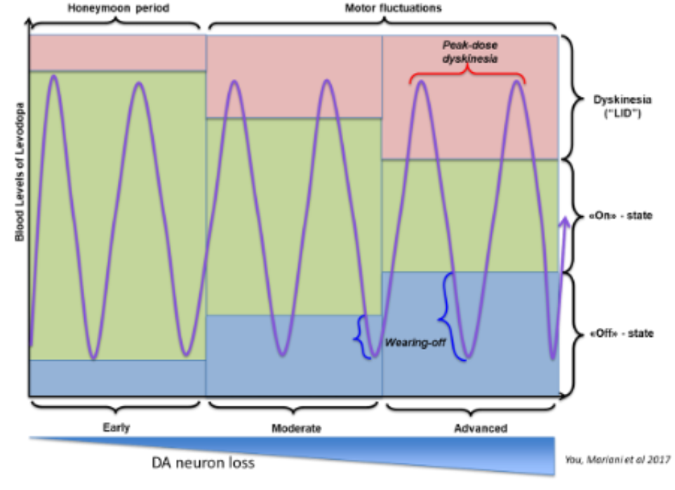
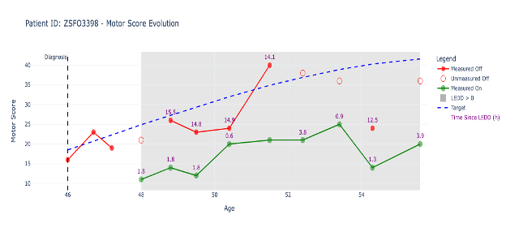
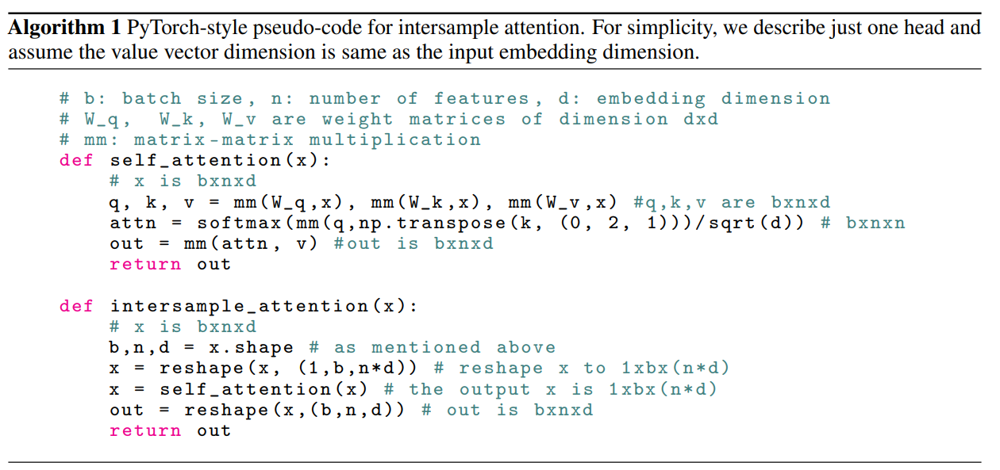
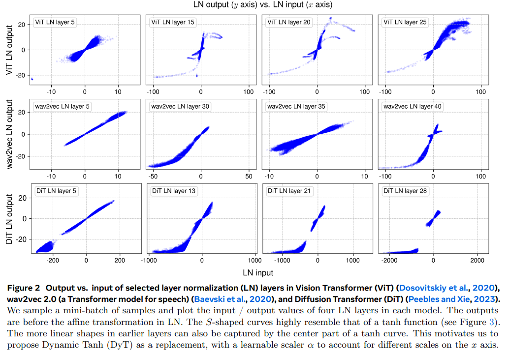

## Introduction : 

This document describes my attempt at the data challenge *"Parkinson's Disease: Predicting and Correcting Bias in Motor Score Evaluation"* by Paris Brain Institute. The challenge's aim is to predict an unbiased estimate of the patients "OFF score" which describes the severity of their motor symptoms when the effects of treatment wear off. Successfully predicting the true OFF score would help counteract biases caused by human subjectivity, incomplete data, or fluctuating treatment's blood level. Furthermore, indirectly predicting the score avoids having patients being in an uncomfortable state. 

## The data :

The data consists of ~55000 rows with the following 12 columns describing the patient's : 
- ID 
- Cohort: (A or B)
- Age
- Sex
- Age at diagnosis
- Relevant genetic markers: {LRRK2+, GBA+, OTHER+, No Mutation}
- Drug information: Dosage in Levodopa Equivalent Daily Dosage (LEDD)
- Motor scores: (0 to 132 with higher score being worse) 
	- ON score (when the treatment is still active)
	- OFF score (a biased clinical measurement which is not available most of the time)

*a visual illustration of what On and Off state corresponds to*

A single patient usually corresponds to multiple rows which allow us to model the progression of their disease. The goal is to predict the unbiased OFF score, represented here by the blue trajectory.

The main difficulty concerning this dataset came from the abundance of null values, as you can see from the row null_count in the following high level description of the dataset.

| statistic | Index | patient_id | cohort | sexM | gene   | age_at_diagnosis |  age  |  ledd  | time_since_intake_on | time_since_intake_off |   on   |  off  |
|-----------|-------|------------|--------|------|--------|------------------|-------|--------|----------------------|-----------------------|--------|-------|
| count      | 55603.0 | 55603 | 55603 | 55603.0 | 37645  | 52773.0 | 55603.0 | 35010.0 | 29663.0 | 11775.0 | 38944.0 | 32196.0 |
| null_count |   0.0   |   0   |   0   |   0.0  | 17958  | 2830.0  |   0.0   | 20593.0 | 25940.0 | 43828.0 | 16659.0 | 23407.0 |
| mean       | 27801.0 |  null |  null | 0.5963527147815766 |  null  | 56.73464839974987 | 62.51642177580347 | 638.1022279348757 | 1.9537167515086136 | 14.199447983014862 | 21.98597986852917 | 26.29531618834638 |
| std        | 16051.347845793718 |  null |  null | 0.4906327380288924 |  null  | 10.82309327558518 | 11.484480244550626 | 219.44318245005658 | 1.1687931366454494 |  2.8447817045395407 | 10.37129108831263 | 16.534566740720642 |
| min        |   0.0   | AADG7112 |   A   |  0.0  |  GBA+  |   16.5 |  16.5  |  50.0  |   0.0  |   6.9  |   0.0  |  0.0  |
| 25%        | 13901.0 |  null |  null |  0.0  |  null  |   49.5 |  54.9  |  481.0 |   1.1  |  12.2 |  14.0 |  13.0 |
| 50%        | 27801.0 |  null |  null |  1.0  |  null  |   56.9 |  62.5  |  611.0 |   1.6  |  13.8 |  21.0 |  24.0 |
| 75%        | 41702.0 |  null |  null |  1.0  |  null  |   64.4 |  70.5  |  765.0 |   2.6  |  15.7 |  28.0 |  38.0 |
| max        | 55602.0 | ZZTP1426 |   B   |  1.0  | OTHER+ |   89.9 | 103.3  | 1796.0 |   6.3  |  25.1 |  95.0 | 106.0 |

The challenge webpage says that they are using a RMSE loss to compute our scores but they are in fact using the standard MSE loss. All subsequent scores will therefore be the MSE loss. 

#### Processing the data : 

I used one hot encoding to deal with non numerical values. I also normalized each columns as I wanted to use a neural network. Moreover after having normalized the columns I set each null values to 0 (they are therefore equal to the mean of the column) and created for each column a special flag column. If a particular row had a null value the associated flag column's entry is set to 1 instead of the default value of 0. I also added a feature "time_since_diagnosis" which is simply the current age minus the age at diagnosis. I tried adding more features, namely ones related to the speed of progression of symptoms, unfortunately none had any significant impact. 

Finally the critical step was to concatenate the different rows associated with the same patient's ID into a single large row. I padded this large row to obtain a standardized size. This is important as the true OFF score of a patient obviously depends on both its past symptoms but also its future symptoms. 

## The model : 

#### FeedForwardNetwork approach : 

Before concatenating the data into a large row i trained a FeedForward network  using one hidden layer and ReLU activation. While simple this approach already allows us to beat the benchmark with a score of 72 versus the benchmark's score of 227. 

#### XGB approach :

The best score I got with an XGBregressor on the unconcatenated data was 49. Using the same model on the concatenated data lowers the loss to around 15. However I did not try optimizing this approach very much as I have more fun building my own model.  

#### Transformer approach : 

My main approach was using a Transformer architecture using time point as tokens. The only ways my architecture deviates from the usual transformer architecture is in the embeddings and output projection. 

To embedd our input we start with a large vector made of the concatenated time points and some padding. 
This vector is of shape : 
*\[ batch_size, context_length$\times$nb_features  \]*

We reshape it into :  
*\[ batch_size, context_length, nb_features  ]*

and apply MLP with 1 hidden layer along the context_length dimension to obtain a vector of dimension :
*\[ batch_size, context_length, hidden_dimension]*

This replaces the usual embedding in the transformer architecture. 

The output projection takes as input a vector of dimension : 
*\[ batch_size, context_length, hidden_dimension]*

and apply a MLP with 1 hidden layer to get :
*\[ batch_size, context_length, 1]*

which is our prediction vector.

To train this model I used cross validation with 5 folds. AdamW and a Learning rate scheduler which cuts the learning rate in half every 20 epochs. 

Using this approach I could score a bit under 9 in my validation set. 

#### Ensembling :

To further improve my model I used deep ensembling. With 20 model trained independently I could lower my error down to ... However the training time were getting prohibitive therefore I tried several approaches to speed up the process. 

##### What failed : 

As I said deep ensembling gave better results but was too time-consuming. I thought this was due to the serial way I trained the models (one after the other) therefore I tried to paralellize the whole process of training the models into training a single big model where I would strategically block the flow of information via masks to simulate differents smaller models being trained. This, sadly, did not achieve any noticeable time reduction. 

In my quest to lower the time cost of deep ensembling I stumbled upon the [batch ensemble paper](https://arxiv.org/pdf/2410.24210). Their idea is to create multiple models from a single one by applying  rank-one perturbations to some of their linear layers. Said more clearly, given the usual linear layer :
$$l(x) = Wx + b$$
the partially shared layer of member i is:
$$l_i(x) = s_i \odot (W (r_i \odot x)) + b_i$$
Where the matrix $W$ is shared between the models but not the $s_i, r_i, b_i$ . 
Unfortunately I did not notice the same performance gains as deep ensembling so I did not pursue this idea further. 

Taking inspiration from [SAINT](https://arxiv.org/pdf/2106.01342) I implemented their intersample attention block.

I thought that looking at other sample could communicate valuable information to the model by knowing for instance if someone is an outlier on certain features. This turned out to not be the case. 

 
 I replaced the Layernorm function with RMSNorm but noticed that each epoch took longer with the RMSNorm which is quite counterintuitive as the whole selling point of RMSNorm is to be capable of the same performance for more speed.  
 

I tried to get rid of normalization altogether following the paper [Transformer without normalization](https://arxiv.org/pdf/2503.10622). Their work starts from the realization that empirically the LayerNorm functions act like tanh.

They propose a new normalization function which they call, dynamic tanh and consists of : 
$$DyT(x) = \gamma * \tanh(\alpha x) + \beta $$
In practice I found that training with dynamic tanh was very unstable and depended a lot on the initialization of $\alpha$ . I did not notice any gain therefore I gave up on this idea. 

### Bibliography :
- [TABM: ADVANCING TABULAR DEEP LEARNING WITH PARAMETER-EFFICIENT ENSEMBLING](https://arxiv.org/pdf/2410.24210)
- [SAINT: Improved Neural Networks for Tabular Data via Row Attention and Contrastive Pre-Training](https://arxiv.org/pdf/2106.01342)
- [Transformer without normalization](https://arxiv.org/pdf/2503.10622)

